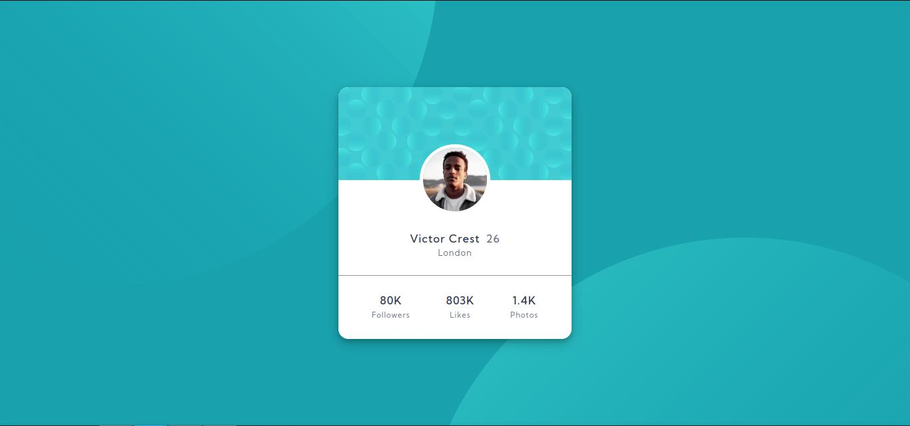

# Frontend Mentor - Profile card component solution

This is a solution to the [Profile card component challenge on Frontend Mentor](https://www.frontendmentor.io/challenges/profile-card-component-cfArpWshJ). Frontend Mentor challenges help you improve your coding skills by building realistic projects. 

## Table of contents

- [Overview](#overview)
  - [The challenge](#the-challenge)
  - [Screenshot](#screenshot)
  - [Links](#links)
- [My process](#my-process)
  - [Built with](#built-with)
  - [What I learned](#what-i-learned)
  - [Continued development](#continued-development)
  - [Useful resources](#useful-resources)
- [Author](#author)

## Overview

### The challenge

- Build out the project to the designs provided

### Screenshot



### Links

- Solution URL: [https://github.com/Nivas23/profile-card-component](https://github.com/Nivas23/profile-card-component)
- Live Site URL: [https://profile-card-component-lake-mu.vercel.app/](https://profile-card-component-lake-mu.vercel.app/)

## My process

### Built with

- Semantic HTML5 markup
- CSS
- Flexbox

### What I learned

I learned to use media query in CSS to fix scaling issue.

To fix the scaling issue, I used the followig CSS snippet:

```css
    @media(min-width:720px){
      body{
        width:375px;
        overflow: hidden;
        }
    }
    @media(max-width:1440px){
      body{
        width:100vw;
        overflow: hidden;
        }
    }
```

### Continued development

- I have to improve the responsive design aspect of the page.
- I need to practice more to use the position attribute in CSS.

### Useful resources

- [Learn CSS Positioning Quickly With A Real World Example](https://youtu.be/MxEtxo_AaZ4?si=ywoj6ffDk64OfRot) - This amazing video helped me finally understand position attribute in CSS.I'd recommend it to anyone still learning this concept.

## Author

- Frontend Mentor - [@Nivas23](https://www.frontendmentor.io/profile/Nivas23)
